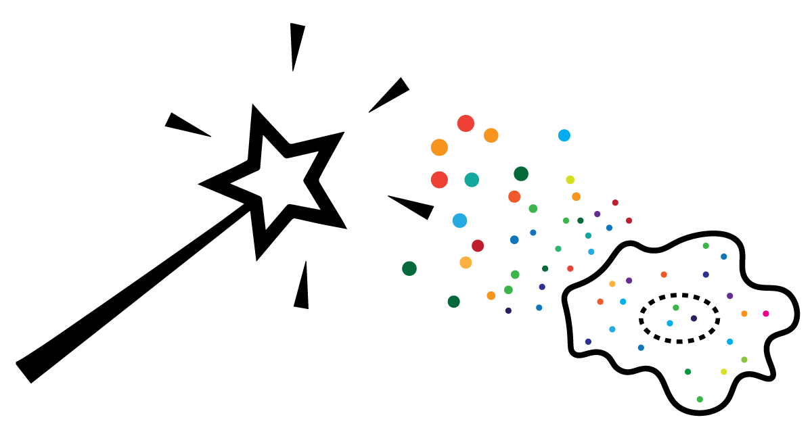

# MERlin 

This repository is a research fork of **MERlin**, an extensible pipeline for
decoding and analyzing MERFISH data. 

## Provenance

The project lineage is:

1. [emanuega/MERlin](https://github.com/emanuega/MERlin) — the original MERlin
   repository developed in the Xiaowei Zhuang laboratory.
2. [aaronhalpern/MERlin](https://github.com/aaronhalpern/MERlin) — Aaron
   Halpern's fork.
3. Aaron Halpern's `gpu_decoding` branch at commit
   [`15ce55f`](https://github.com/aaronhalpern/MERlin/commit/15ce55f919eed7e986c7a9c79eb59ef41f39e1c8)
   — the baseline for this fork.
4. [jiahaozhang2025/MERlin](https://github.com/jiahaozhang2025/MERlin) — this
   repository, containing the subsequent adaptations.

## What MERlin does

MERlin organizes a MERFISH workflow as a collection of analysis tasks. Tasks
can run locally or be split into fragments for parallel execution through
Snakemake and a cluster scheduler. The pipeline covers image registration,
preprocessing, barcode decoding and filtering, cell segmentation, and export
of spatial features and barcode data.



See [DETAILED_CHANGES.md](DETAILED_CHANGES.md) for the module-by-module
tree comparison, parameters, caveats, and exact history boundary.

## Installation

This is research software with environment-specific components. Create an
isolated environment, install system-level dependencies such as `rtree` and
PyTables as appropriate for the platform, then install this repository:

```bash
git clone https://github.com/jiahaozhang2025/MERlin.git
cd MERlin
pip install -e .
```

## Configuration and use

MERlin reads its main paths from `~/.merlinenv`:

```dotenv
DATA_HOME=/path/to/raw-data
ANALYSIS_HOME=/path/to/analysis-output
PARAMETERS_HOME=/path/to/merfish-parameters
```

`PARAMETERS_HOME` contains analysis JSON files, codebooks, data-organization
tables, microscope parameters, positions, and Snakemake settings. MERlin can
create the environment file interactively:

```bash
merlin --configure .
```

A typical local run is:

```bash
merlin \
  -a analysis_parameters.json \
  -m microscope.json \
  -o data_organization.csv \
  -c codebook.csv \
  -n 5 \
  dataset_name
```

The inherited documentation in [`docs/`](docs/) describes the MERlin task
model and file layout. Some pages still reflect the original MERlin release,
so verify task parameters against the current source and the detailed change
record.

## Original authors and citation

The original MERlin repository identifies:

- George Emanuel — initial work
- Stephen Eichhorn
- Leonardo Sepulveda

If MERlin is useful for your research, cite:

> Emanuel, G., Eichhorn, S. W., and Zhuang, X. (2020). *MERlin — scalable and
> extensible MERFISH analysis software*, v0.1.6.
> [doi:10.5281/zenodo.3758540](https://doi.org/10.5281/zenodo.3758540)

This fork also acknowledges Aaron Halpern's additional work, from which the
current branch descends.

## License

MERlin is distributed under the terms in [license.md](license.md).
