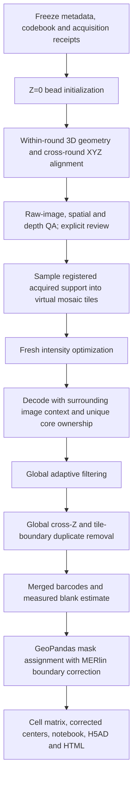

# Stitched decoding in MERlin_jiahao

This opt-in workflow ports the completed 0718 stitched run into MERlin's native
analysis-task, dependency, fragment, logging and completion machinery. Existing
per-FOV `Warp`, `Preprocess`, `Decode` and `PartitionBarcodes` tasks are unchanged.
The new entry points are in `merlin.analysis.stitched`.

## What the 2 × 2 pilot established

The pilot used source FOVs 13, 14, 25 and 26. Z=0 fiducial beads initialized the
relative XY placement. Three-dimensional bead measurements then constrained
within-round geometry and cross-round XYZ alignment. Image support from the
neighbors provided the context needed to decode molecules near a field boundary.

The complete sample uses all 52 source fields, with fresh full-field fits. It does
not extrapolate the four-field pilot transforms. Its image mosaic is sampled on
demand: output tiles are 2048 × 2048 half-open cores, while source selection can
use any supported overlapping camera. An output tile is not a source FOV and is
not necessarily a fixed four-camera mosaic.



## Scientific operators and parameters

* Registration uses the accepted full-field quadratic geometry with shared radial
  camera correction, anchored to round 0/FOV 13. Z=0 initializes placement; it
  does not replace the full XYZ fit. The explored PolyWarp variant was not the
  accepted geometry used for the completed first-codebook run.
* Within each bit/round, source ownership chooses the supported camera with the
  greatest interior margin. Raw XY sampling is bilinear; Z sampling uses the
  actual channel-specific XML frame schedule. No fabricated support or missing
  depth extrapolation enters the decoding mask.
* Require measured support in every bit and a 64-pixel preprocessing margin.
  Preprocessing is high-pass sigma 3, low-pass sigma 1, then five Lucy–Richardson
  iterations with sigma 2/kernel 9. These options are explicit because current
  `merlin_jiahao` has newer preprocessing defaults.
* Fresh calibration uses 50 training and 12 validation planes, selected over the
  sample, and 20 optimization iterations with a convergence gate. Calibration
  uses Euclidean distance 0.52 and area 4. No previous scale factors are reused.
  Current MERlin's optional scale normalization is explicitly disabled to retain
  the completed run's absolute intensity-scale convention.
* Final decode uses Euclidean distance 0.65, magnitude threshold 1 and area 4.
  Decode context starts at 64 pixels and grows up to 2048 if a component that
  intersects the core touches the context boundary. An unresolved truncated
  component fails the task. The centroid assigns each whole component to exactly
  one output core.
* Adaptive filtering calls the current canonical MERlin binning, histogram and
  threshold operators, streaming the global candidate population. Target = 5%
  codebook-normalized blank/coding estimate. The target is applied before
  deduplication; it is not a guarantee for the final population.
* Canonical duplicate removal operates on each complete barcode identity across
  all tiles and depths, using the existing two-plane/1.4-pixel criterion. Final
  exports recompute the actual normalized blank estimate. For the completed
  first-codebook run, 28,888,413 deduplicated candidates had **6.2047%**, not 5%.
* Partitioning uses exact mask-pixel footprint polygons, GeoPandas spatial joins,
  and MERlin's 0.5 µm native-XY boundary correction. Existing cell IDs and crop
  offsets are preserved. Interior barcode-type evidence is pooled globally to
  account for unique global barcode ownership. No Z dilation or endpoint clipping.
* Corrected cell centers use a supported neighboring reference camera when their
  own camera cannot map the center. This is the repair that removed artificial
  plot gaps; it does not change cell counts. Ambiguous mappings remain flagged.
* Optional analysis produces QC, count layers, Leiden clustering, markers, H5AD,
  a notebook and offline 3D UMAP/tissue HTML with matching cluster colors.
  Leiden labels are exploratory clusters, not annotated cell types.

## Supported acquisition and inputs

The explicit validated profile is `0718_40x_150z`: 52 source fields 0–51,
2048-square DAX frames, 0.1493 µm/pixel, 150 fiducial depths, and the 0718 frame
schedule. Preflight validates every requested raw size, mtime and XML hash.
DAX content is not fully hashed. Other dimensions, field counts or acquisition
profiles require a separately validated extension; the profile is not a promise
of generality across samples.

Metadata directory: `positions.csv`, `dataorganization.csv`, `filemap.csv`,
`microscope_parameters.json`, and `codebook_<index>_<name>.csv` with `name,id,bit...`
columns. Select one codebook per run. Codebook 0 selects 0718 ulipstic1; codebook 1
selects ulipstic2. Rounds are derived from the selected bits plus reference round 0.
Optimization, thresholds, exports and receipts are separate for each codebook.

Optional mask archive root contains `data/positions.csv` and the existing 0718
`segmentation/` archive, including `seg_offsets_final.json`, `aff_constants.json`,
`fragments_true_v71.csv`, `cells_final_true_v71.csv`, per-stack cells and masks.
The archive adapter currently requires its 149 × 1024 × 1024 uint32 mask format.
It retains inherited registration limitations rather than claiming a new mask fit.

## Create a native MERlin pipeline

Install additional packages in the intended environment, if needed:

```bash
python -m pip install -e '.[stitched]'             # through partitioning
python -m pip install -e '.[stitched-analysis]'    # also notebook/H5AD/HTML
```

Create configuration files without submitting any work:

```bash
python -m merlin.util.stitched.configure \
  --output /absolute/path/stitched_analysis.json \
  --cluster-output /absolute/path/stitched_cluster.json \
  --metadata-dir /absolute/path/frozen_metadata \
  --raw-root /absolute/path/raw_sample \
  --codebook-index 0 \
  --review-decision /absolute/path/alignment_decision.json \
  --mask-archive /absolute/path/ulip3D \
  --analysis-report
```

The decision file need not exist when configuring. Registration and QA run first;
`StitchedReview` stops with review artifacts until an evidence-matched decision
exists. Omit `--mask-archive` and `--analysis-report` for barcode-only output.
Use a distinct output analysis directory or task prefix for each codebook.

Use the JSON as an ordinary MERlin analysis parameter file in the existing
deployment's `parameters/analysis` directory. Generate the normal MERlin DAG with
`merlin SAMPLE -a stitched_analysis.json --generate-only` and the same data,
microscope, codebook, positions and analysis-home arguments used for a new dataset.
Do not point a new run at an old result directory.

Alternatively, for an already initialized MERFISHDataSet:

```python
import json, sys
from merlin.util.snakewriter import SnakefileGenerator
parameters = json.load(open('/absolute/path/stitched_analysis.json'))
snakefile = SnakefileGenerator(parameters, data_set, sys.executable).generate_workflow()
print(snakefile)
```

The emitted rules use MERlin's standard `-t TASK -i FRAGMENT` interface. They do
not recursively submit Slurm jobs. For Slurm, use the generated cluster-resource
JSON with the existing Snakemake 7 cluster mechanism, for example:

```bash
snakemake --snakefile /absolute/path/generated.Snakefile --jobs 8 \
  --cluster-config /absolute/path/stitched_cluster.json \
  --cluster 'sbatch --parsable --partition=shared --account=zhuang_lab --cpus-per-task={cluster.cpus} --mem={cluster.mem_mb}M --time={cluster.minutes}'
```

Adjust account/partition to the cluster. Run the scheduler in an allocation or
per local cluster policy. MERlin's existing Snakefile writer does not emit local
CPU/memory resource constraints, so do not run this large workflow with unrestricted
local parallel jobs. Optimizer requests eight CPUs by default (four workers × two
threads); each decode fragment requests two. A decode fragment resumes its own
round-robin list of planned tile/depth chunks; all image planes are still covered.

## Alignment review and registration reuse

Review outputs are inside
`<analysisPath>/StitchedInitialize/stitched_run/registration_review/`:
`summary.json`, `all_windows.json`, `evidence.json`, `raw_image_overlays.png`.
All geometry and aggregate/depth gates must pass first. Sparse or ambiguous
windows are not counted as successful measurements. The decision must include:

```json
{
  "decision": "accept_common_support",
  "evidence_sha256": "copy the exact current evidence hash",
  "reviewed_by": "reviewer name",
  "acknowledged_pointwise_exceptions": [],
  "acknowledged_unsupported_sources": {},
  "limitations": ["Describe the reviewed limitations."]
}
```

Copy the exact exception list and unsupported-source map from the summary; empty
placeholders are not valid if those lists contain entries. Then retry only
`StitchedReview`, for example `data_set.load_analysis_task('StitchedReview').run(overwrite=True)`.
This resets that task's status, while its scientific receipts are preserved and
verified. Review artifacts
are regenerated deterministically; the accepted manifest binds them to hashes.

Instead of refitting identical data, pass `--reuse-registration` with an accepted
manifest and omit `--review-decision`. The integration verifies all requested
metadata and acquisitions and every protected model, and reads prior geometry
without modifying it. It still creates fresh intensity optimization and filtering.
It rejects a manifest missing requested rounds: ulipstic1 geometry alone cannot
serve ulipstic2 rounds 11–16.

## Outputs, reproducibility and resumption

Each initialization freezes metadata, configured operators and the current
canonical `merlin` package in its private run directory. Later checkout edits
cannot change running jobs. `OPERATOR_PROVENANCE.json` records the original 0718
operator hashes and the explicit compatibility edits; `frozen_sources.json`
records each run's actual sources and inputs.

Key paths under `StitchedInitialize/stitched_run/`:

| Output | Path |
| --- | --- |
| Accepted geometry and scope | `registration_accepted_radial_v1.json` |
| Fresh scales/convergence | `full_optimization_v1/optimization.json` |
| Raw decode inventory | `full_decode_v1/raw_manifest.json` |
| Final global barcodes | `full_filter_v1/exports/adaptive_filtered_z_deduplicated.csv.gz` |
| Counts and actual blank estimate | `full_filter_v1/exports/complete.json` |
| Coverage/quality review | `final_review_v1/` |
| Partitioned barcodes, matrix, metadata | `partition_sjoin_v2/exports/` |
| Corrected spatial metadata | `partition_sjoin_v2/cell_coordinates_v3/` |
| Notebook, H5AD, cluster and tissue HTML | `basic_analysis/` |

Completion receipts and file hashes are checked before reuse. Failed partial
scientific outputs are not silently erased or overwritten; preserve the failed
attempt before explicitly restarting it. MERlin task statuses and per-stage
receipts provide two levels of accounting. Partition delivery requires both
`complete.json` and independent `verification.json` with count conservation.

The notebook is a basic analysis of these outputs. External TS2 comparisons and
biological cell-type annotation are not bundled reference datasets; they require
the user's separate reference inputs. This integration does not restart the
completed first-codebook analysis or the independently running ulipstic2 jobs.
